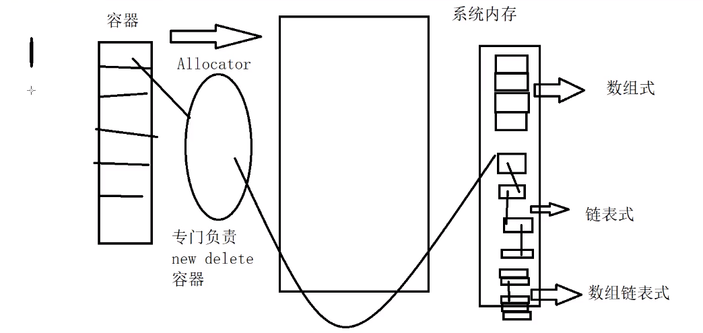

# allocator 概念


allocator 技术就是容器空间的管理技术，系统内存有 3 种组织形式，数组式、链式、数组链式，容器涉及内存的分配和回收，allocater 就是帮助完成这个步骤用的。
C++由 new 操作，分为两个过程，一个是分配内存，一个是调用构造函数初始化对象。系统分配内存也有两个方式，在上述 C++ new 操作的第一个过程中，其实调用的是 operator new 完成分配内存，这是系统分配内存的一种方式，即按照一定大小分配内存，另一个系统分配内存的方式是 **placement new**, 比如如下语句 ```new (p) T(val)```，完成的操作是调用 T 的默认构造函数用 val 初始化对象，然后用 p 指向对象（《 STL 源码剖析》第二章就会讲到这个内容，第一遍没看懂，以为是 new 操作的其它写法，其实不是，应该是全局的 **placement new**）。

```c++
// new: == malloc => C++个原生函数
// void * operator new (size_t size)
// operator: 

    class TestMemClass{};
    TestMemClass *p = new(sizeof(TestMemClass)*10);
    (TestMemClass*)::operator new

// placement new
    void* operator new (std::size_t count ,void *ptr){
        return ptr;
    }
    new(p1)TestMemClass(100)


```

```c++
#include <iostream>
using namespace std;

class T {
public:
    T (int v) {
        val_ = v;
        cout << "Constructor val_ = " << val_ << endl;
    }
    ~T () {
        cout << "Destructor val_ = " << val_ << endl;
    }
private:
    int val_;
};
int main () {
    //创建了一个能存放10个TestClass对象的内存
    T * p = (T*)::operator new(sizeof (T) * 10);
    //在这个内存块中，我们使用placement new来创建一个对象
    T * p1 = p;
    new(p1) T (24);
    p1->~T ();

    T *p2 = p+1;
    new(p2)T (256);
    p2->~T ();
    ::operator delete(p);

    return 0;
}
```

接下来的课程里面，老师实现了一个 allocator ，并且演示了使用此分配器作为 vector、list、dequeue 的时候，上面三个容器的分配策略。vector 是每次重新申请为原容量二倍的空间，list有新元素加入则申请1个空间，dequeue申请的内存是数组链表形式，不同的操作系统的实现是不同的。

