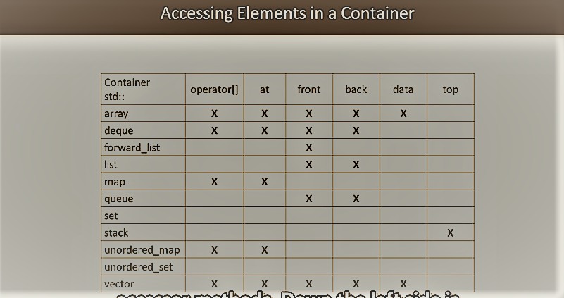

# Udemy 课程 《STL 实用编程》笔记
 
学习 stl 的好教材《The C++ programming language-4th Edion》,  还有《 C++ 标准库》。

配合《Effective STL》学习，并且要留下代码及笔记。笔记是思考成果的凝练，代码是最好的复习资料，直观、实用，光有笔记没有代码的记录时间一长因为遗忘都会成假把式。

## 1 概述、模板
stl 以模板技术为基础，其实现、调用有自己的一套逻辑，这个笔记先将 stl 涉及的内容走一遍流程，然后再从资料中总结一些 stl 使用的实用技术。

PS: 查阅资料经常出现的几个单词含义，见[资料](./ch01_template/README.md)。

*template.cpp* 展示了模板类、模板函数、lambda 模板函数的使用，其中 lambda 模板函数在 Visual Studio 2017 中不可用。模板类中还演示了友元函数 << 写法，用来访问类的私有成员变量。
```c++
#include <iostream>
using namespace std;

template <typename T>
class Container {
   public:
    explicit Container(T t) : t(t) {}

    friend std::ostream& operator<<(std::ostream& os, const Container<T>& c) {
        return (os << "private T t == " << c.t);
    }

   private:
    T t;
};

template <typename T>
bool isGreator(T t1, T t2) {
    return t1 > t2;
}

int main() {
    Container<int> c_i_obj(100);
    Container<string> c_str_obj("ssss");

    cout  << c_i_obj << endl;
    cout  << c_str_obj << endl;

    cout << "Test template functions isGreator(template func & lambda func)"
         << endl;

    cout << isGreator(110, 22) << endl;       // 1
    cout << isGreator(12.3, 12.2) << endl;    // 1
    cout << isGreator("AAA", "ZZZ") << endl;  // 1
    cout << isGreator('z', 'a') << endl;      // 1

    // template lambda feature not supported in visual studio 2017
    auto f = []<typename T>(T t1, T t2) { return t1 > t2; };
    cout << "lambda function isGreator(T t1, T t2)" << endl;
    cout << f(110, 22) << endl;       // 1
    cout << f(12.3, 12.2) << endl;    // 1
    cout << f("AAA", "ZZZ") << endl;  // 1
    cout << f('z', 'a') << endl;      // 1

    return 0;
}

// build by - g++ xxx.cpp -o xxx -Wall -Wextra --std=c++17

```
*memory.cpp* 演示了智能指针 unique_ptr 的用法，只能指针是现代 C++ 解决资源泄露问题的一个手段，用 valgrind 检测 memory 程序，可以看到资源泄露情况，new 必须和 delete 对应。
```c++
#include <iostream>
#include <memory>
#include <string>
using namespace std;

class Widget {
   public:
    Widget(string s) : str(s) {
        cout << "Constructing Widget" << endl;
        cout << "str == " << str << endl;
    }

    virtual ~Widget() {
        cout << "Destroying Widget" << endl;
        cout << "str == " << str << endl;
    }

   private:
    string str;
};

int main() {
    Widget* w = new Widget("new");
    unique_ptr<Widget> uw = make_unique<Widget>("unique_ptr");
    // 没有delete，内存不会释放
    // delete w;
    return 0;
}
```
valgrind 测试如下：


其它示例还包括了正则表达式、字符串、异常机制，最后的项目是一个比特币相关项目。
```c++
#include <curl/curl.h>

#include <array>
#include <cstdio>
#include <functional>
#include <iostream>
#include <memory>

#include "json.hpp"

typedef std::unique_ptr<CURL, std::function<void(CURL *)>> CURL_ptr;

// CURL * 类型在 C 语言中为 void* 类型，它可以指向任何类型
// 因此没有办法提前获知具体的析构函数，需要定制资源释放模块
class CurlHandle {
   public:
    CurlHandle() : curlptr(curl_easy_init(), deleter) {
        curl_global_init(CURL_GLOBAL_ALL);
    }

    void setUrl(std::string url) {
        curl_easy_setopt(curlptr.get(), CURLOPT_URL, url.c_str());
    }

    CURLcode fetch() { return curl_easy_perform(curlptr.get()); }

   private:
    CURL_ptr curlptr;
    constexpr static auto deleter = [](CURL *c) {
        curl_easy_cleanup(c);
        curl_global_cleanup();
    };
};

class Bitcoin {
   public:
    Bitcoin() : curlhandle({}) { curlhandle.setUrl(API_URL); }

    void fetchBitcoinData() { curlhandle.fetch(); }

   private:
    CurlHandle curlhandle;
    static constexpr const char *API_URL = "https://blockchain.info/ticker";
};

int main() {
    Bitcoin bitcoin;
    bitcoin.fetchBitcoinData();
    return 0;
}
```
## 2 容器
不同于 C 语言的数组，及依赖结构体实现的各种逻辑存储结构，如链表，树等。STL　的容器直接封装了可包含各种数据类型及其操作的抽象数据结构，用户无需关心资源分配、释放、数据类型管理这类问题。STL　对数据的操作是有自己的特殊逻辑，与　C　语言使用下标、指针不同，stl 使用的是迭代器，迭代器也是属于 stl 的一部分。stl 各类容器有各自的特性，如自动管理空间（扩容、回收），元素自动排序，元素无重复，插入操作复杂度低，访问操作复杂度低......因此，选择恰当的容器对设计程序而言很重要。

容器可以分为序列容器（array、vector），元素根据位置组织，位于连续的内存空间；关联容器（maps、sets、undored_maps、unordered_sets），元素不再顺序存储，而是借助 keys 获取访问权限，元素可以松散排序（lossely ordered）用于查找算法；适配器容器（stack、queue、priority queue）是对现有容器的封装，并且提供了新的 API.

这是 stl 容器的[详细说明](./ch02_container/README.md)。

容器不是独立存在的技术,在使用中除了利用迭代器操作之外,容器经常与 <algorithm> 联合使用.



文档内容请参考每个文件夹下 /html/index.html 文件,文档用 doxygen 生成.

## 3 迭代器

迭代器可以分为：输入、输出、前向、双向、随机读取、连续迭代器（contiguous C++17），通过 iterator_traits 每个迭代器表征特性。

迭代器具有如下特性：复制构造(X a, X b(a))，赋值初始化(=),析构性，交换性，数值类特性(如 value_type,difference_type,reference......),反引用（*it),自增。

迭代器是重要的，因为所有的STL操作是基于迭代器的，迭代器允许以不显示声明(collction-agnostic)的方式遍历顺序元素。迭代器可以用于创建构造器（generator)。

为了有效利用迭代器，迭代器的特性必须定义，包含：difference_type 表示两个迭代器差值的类型；value_type 反引用迭代器得到这个类型，同时禁止对输出迭代器使用；pointer，reference,iterator_category。

### 3.1 input iterators

Input iterator add a few small requirements on top of a base iterator.It can read from the pointed-to element.Input iterator 仅仅适用于单通道算法（single pass algo），一旦自增，之前值的所有拷贝都可能无效，例子：steam iterator 从键盘输入得到字符，迭代器自增，原来的输入的字符已经不见了，不要去访问了。

### 3.2 output iterators

output iterators can used in a sequential output operations,where each element pointed by the iterator is written a value only once, and then the iterator is incremented.

Algorithm requireing output iterators should be single-pass output algorithm.

* each iterator's position is deferenced, once at most. lvalue derefenceable.Must be a class or pointer type.

* equality and inequality may not be defined for output iterators(Not required or not guaranteed to be there)

### 3.3 forward iterators

FI Can be used to acess the sequeue of elements in a range in the direction that goes from its begining towards its end.There is a key difference from input iterators that input iterators are only single-pass guarantedd,FI must be multi-pass guarantedd.If a FI satisfies the requirements for an output iterator,it is mutable forward iterator.(如果没有自增操作，则永远指向某个元素)

FI satisfies the input iterators, but don't need to statisfy the output iterators.

### 3.4 bidirectional iterators

与FI相比，可以执行自减操作。 

### 3.5 Random-access iterators

Random-access iterators can be used to acess elements at an arbitrary offset position（任意偏移位置），与指向的元素相关联，但是提供指针一样的功能（functionality）。功能上是最复杂的迭代器种类。

符合双向迭代器的特性，常数时间消耗的任意数量的偏移，

### 3.6 auxiliary（辅助） iterator functions

The iterator library offers some special functions that can be used universally, regardless of the type of iterator they are used on:next,prev,advance,distance

The library also provides special functions to access the iterators defined in containers: begin,end,rbegin,rend.They also are available with a c prefix for const.

### 3.7 iterator adapters(适配器)

适配器接收（take in）迭代器，并且改变它的部分行为。例如，reverse_iterator 接收双向迭代器使其逆向运行；move_iterator 接收任意类型的input iterator反引用使其产生右值引用（如同 std::move 的使用）。

iterator header defines serveral special iterators for developers to use.例如：insert_iterator, front_insert_iterator, back_insert_iterator, ostream_iterator, istream_iterator, istreambuf_iterator, ostreambuf_iterator.


## 4 算法

在头文件<algorithm> 中，counting、searching、sorting、partitioning and transforming ...

All algorithm operate on range [first,last), ref: https://en.cppreference.com/w/cpp/algorithm.

cpp17 add execution policies for algorithm，包括顺序执行，并行执行等，在<execution>中定义，编译器支持不完全，仅作了解，to compare what compilers can do can use Compiler Ecplorer ：https://godbolt.org

### Sequence（顺序） Algorithm

算法根据是否会对原始数据进行修改分为两种，一般能够明显区分，不确定的时候，在调用算法前对原始数据进行copy操作。

for_each 两者皆可，equal binary predicates，两个操作数。

move 操作，transform the owner of items,当不能用copy的时候，如线程等情况，可用 move.

示例，unique_ptr 不能被 copy，用move。

本章要学习学习一下lambda、std::function的使用。

## 5 IO

路径 img/ 下有对 input stream、output stream、io stream 的原理图。  

## 6 内存

介绍了几种只能指针，及 allocator 使用、调试，未初始化内存相关内容，allocator 据说会在以后的版本中废弃，所以不深究这里的细节。但其调试等内容，对理解 C++　及系统相关内容可能有帮助。

## 7 线程

介绍了几种 C++ 线程同步机制。
## PS

以后章节的内容不是简单的给几个示例程序就能说明白的，而且我已经入门了那些内容，因此仅仅拷贝一些源文件到对应目录，接口调用是容易的，难的是在工程中实践应用.

这是一个关于 stl 的讲座，总体上一窥 stl 。

105 STL Algorithms in Less Than an Hour

[Video Link](https://www.bilibili.com/video/av46316166?from=search&seid=16850541774524193645)

说明

这个视频对 STL 算法的学习组织进行说明，视频中提到：即便要掌握这些算法的概况，每个部分所花的时间小于1小时都是很现实的，标题只是一个噱头。

目录（视频）

* heap 

    * make_heap

* sort

* permutation

* numeric algorithms

    * inner_product
    * adjacent_difference
    * sample

* querying of a propertyqu on 2 ranges

*  search
*  


